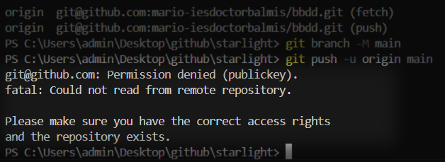

# Plantilla Balmis Starlight 
## Requisitos

- Visual Studio Code
- NodeJS (npm)
- d2 (Diagramas)
- Python
- git
- Tener cuenta en github (la del centro es buena opción)


**Instalar todos a la vez**
  - copia y pega en PowerShell (como admisnistrador)
```sh
winget install -e --id OpenJS.NodeJS # NPM
winget install -e --id Microsoft.VisualStudioCode # VS code
winget install -e --id Terrastruct.D2 #D2
winget install --id=Python.Python.3.12  -e # Python
winget install --id Git.Git -e --source winget #GIT
```

## 1.- VS Code

 - Abrimos VS code y la carpeta de trabajo
  
 - Abrimos el terminal
  

## 2.- Clonar repositorio

Desde el terminal de visual studio clonamos y entramos a la carpeta

```sh
git clone https://github.com/mario-iesdoctorbalmis/starlight miModulo 
# miModulo = el módulo o carpeta de trabajo //Vale cualquier nombre
```
  

## Instalar librerías necesarias 
 - Lanzar el comando:
```sh
npm install
```

> [!NOTE]
> #### ¿Qué hace `npm install`?

> 1. **Instala dependencias**:
>    - Cuando ejecutas `npm install` en el directorio > raíz de tu proyecto, Node Package Manager (npm) lee > el archivo `package.json` y descarga todas las > dependencias listadas en la sección `dependencies` > y `devDependencies`.
> 
> 2. **Crea la carpeta `node_modules`**:
>    - Las dependencias descargadas se almacenan en una > carpeta llamada `node_modules` dentro del > directorio de tu proyecto.
> 
> 3. **Genera o actualiza el archivo `package-lock.> json`**:
>    - Este archivo contiene una lista detallada de las > versiones exactas de cada paquete instalado, > asegurando que las mismas versiones se instalen en > cualquier entorno donde se ejecute `npm install`.
> 
> #### Ejemplo
> 
> Supongamos que tienes un archivo `package.json` con el > siguiente contenido:
> 
> ```json
> {
>   "name": "mi-proyecto",
>   "version": "1.0.0",
>   "dependencies": {
>     "express": "^4.17.1"
>   },
>   "devDependencies": {
>     "nodemon": "^2.0.7"
>   }
> }
> ```
> 
> Al ejecutar `npm install`, npm descargará e instalará > `express` y `nodemon` en la carpeta `node_modules`.
> 

  - Si da error, sigue el siguiente [manual](https://rogamainformatica.es/npm-ejecucion-scripts-deshabilitada-sistema/)
  1. Ejecuta Powershell como administrador
  2. Lanza el siguiente comando `Set-ExecutionPolicy Unrestricted`
  3. vuelve a VS Code e intenta de nuevo


## GIT y GITHUB

Desde `consola de VS code` configuramos git
### Configuración básica de GIT

```sh
$ git config --global user.name "John Doe"
$ git config --global user.email johndoe@example.com
```

### Creamos nuevo repositorio en nuestro espacio
   1. Vamos a la página de [github](https://github.com)
   2. Creamos repositorio nuevo (público o privado)
    
      1. Resultado:
        

### 

```sh
git remote add origin git@github.com:mario-iesdoctorbalmis/bbdd.git
git branch -M main
git push -u origin main
```

Si fallase el add:

```sh
git remote set-url origin git@github.com:mario-iesdoctorbalmis/bbdd.git
git branch -M main
git push -u origin main
 ```

### Posible error:

Parece que estás teniendo un problema con la clave SSH al intentar acceder a un repositorio de GitHub. Aquí tienes algunos pasos para ayudarte a resolverlo:

¡Entendido! Aquí tienes los pasos adaptados para PowerShell:

1. **Verifica si tienes claves SSH existentes**:
   Asegúrate de tener un par de claves SSH. Puedes verificarlo ejecutando:
   ```powershell
   ls ~/.ssh
   ```
   Si ves archivos como `id_rsa` y `id_rsa.pub`, ya tienes un par de claves SSH.

2. **Genera una nueva clave SSH (si es necesario)**:
   Si no tienes un par de claves SSH, genera una usando:
   ```powershell
   ssh-keygen -t ed25519 -C "tu_correo@example.com"
   ```
   Sigue las indicaciones para guardar la clave en la ubicación predeterminada.

3. **Añade tu clave SSH al agente SSH**:
   Inicia el agente SSH y añade tu clave:
   ```powershell
   Start-Service ssh-agent
   ssh-add ~/.ssh/id_rsa
   ```

4. **Añade la clave SSH a tu cuenta de GitHub**:
   Copia tu clave SSH al portapapeles:
   ```powershell
   Get-Content ~/.ssh/id_rsa.pub | Set-Clipboard
   ```
   Luego, ve a GitHub > Settings (Configuración) > SSH and GPG keys > New SSH key (Nueva clave SSH), y pega tu clave.

5. **Prueba tu conexión SSH**:
   Verifica tu conexión a GitHub:
   ```powershell
   ssh -T git@github.com
   ```
   Deberías ver un mensaje de éxito si todo está configurado correctamente.
