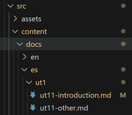

## Modo de trabajo
- Fichero de configuración con menú lateral: `astro.config.mjs`
- Estructura de documentos .md
  
## Ficheros

:::danger[A tener en cuenta]
Si en el fichero de menú `astro.config.mjs` aparece una página como **ut1/ut11-introduction**, este debe existir, al menos, en el idioma por defecto. **Ahora mismo el Español.**
:::

```js
//astro.config.mjs
...
items: [
        'ut1/ut11-introduction',
        'ut1/ut11-other',
        ],     
... 
```


- Cambia ahora el idioma a _inglés_ y verás que aparece un mensaje de que no está disponible en ese idioma y muestra la página en el idioma por defecto. En _valenciano_ si que existe pero está vacío.

## Cambios de imágenes u otros objetos que se quedan en caché

A veces no le sienta bien estos cambios y da error. Tan fácil como cerrar el proceso del servidor en consola mediante `ctrl+c` y volver a lanzar `npm run dev` en tu terminal

## D2 Diagrams
Debes instalar en tu PC **D2**
https://github.com/terrastruct/d2/blob/master/docs/INSTALL.md

- **Powershell en modo administrador**


### uso
[Astro D2](https://astro-d2.vercel.app/examples/hello-world/)
### Ejemplo
#### código
```dedos sketch pad=10 width=500 layout=elk
//código de d2
direction: right

Astro.Markdown -> D2 -> SVG -> Browser.Diagrams -> Astro.Markdown: {style.animated: true}
```

#### resultado
```d2 sketch pad=10 width=500 layout=elk
direction: right

Astro.Markdown -> D2 -> SVG -> Browser.Diagrams -> Astro.Markdown: {style.animated: true}
```
holavmundo